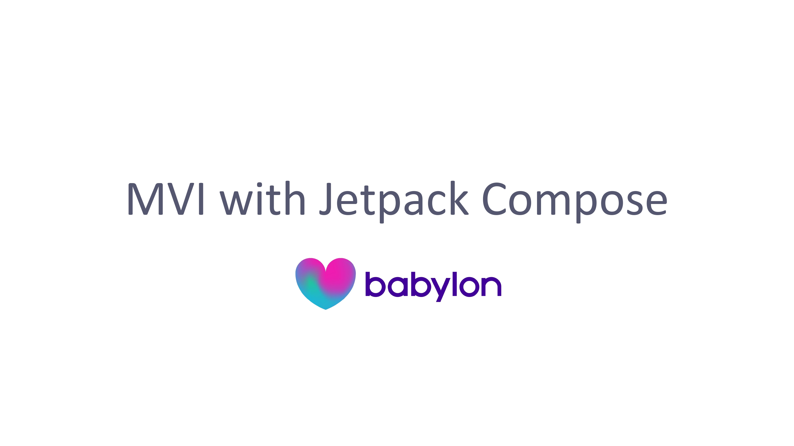
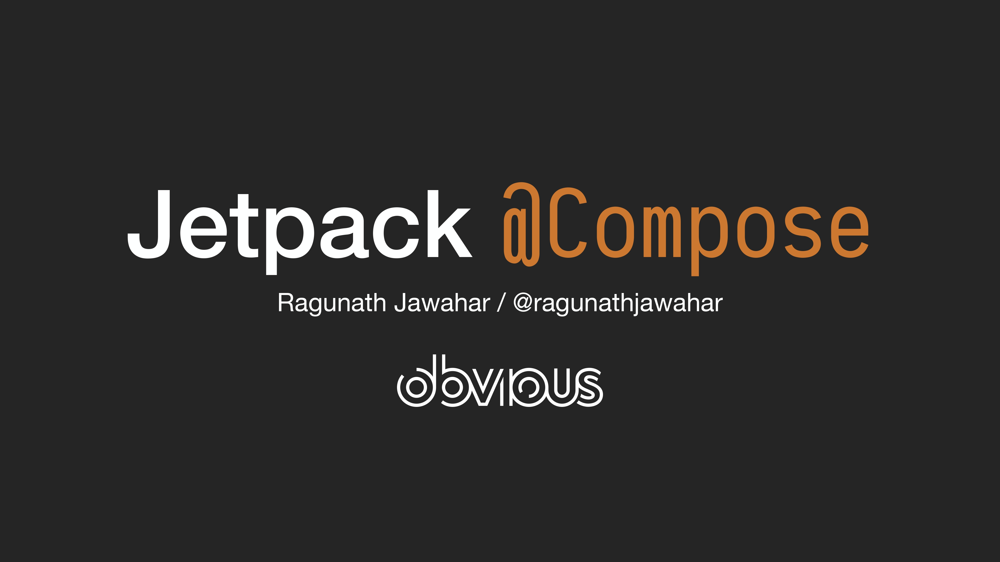
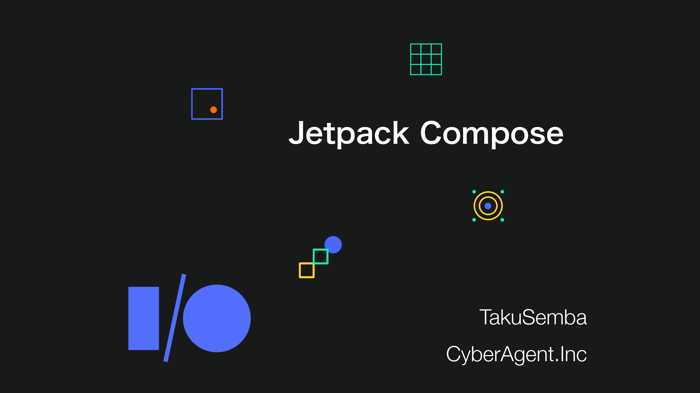
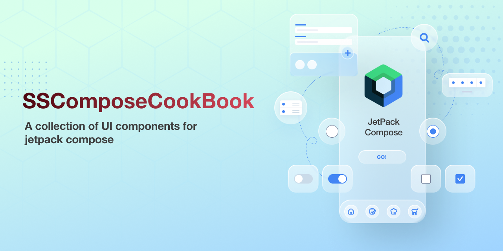

<h1 align="center">Awesome Jetpack Compose Learning Resources</h1> 

:eyeglasses: A continuously updated list of learning Jetpack Compose for Android apps.

 

  
  
  

 

</img>

 

**Awesome Jetpack Compose Learning Resources** aims to be your starting point to find the finest learning content for Jetpack Compose suites of libraries.

Content in languages other than English is tagged according to ISO 639-2 codes.

## Contents

- [Docs, Codelabs, and Official Projects](#docs-codelabs-and-official-projects)  

    - [Docs](#docs)
    - [Codelabs](#codelabs)
    - [Official Projects](#official-projects)
    - [Resources](#resources)

- [Articles and Tutorials](#articles-and-tutorials)

- [Slides](#slides)

- [Talks, Conferences, and Interviews](#talks-conferences-and-interviews)

- [Videos](#videos)

- [Twitch Channels](#twitch-channels)

- [Books](#books)

- [Apps](#apps)

- [Twitter Threads](#twitter-threads)

- [Podcasts](#podcasts)

- [Frequently Asked Questions on Jetpack Compose](#faq-on-jetpack-compose)

- [Communities](#communities)

:memo: [**Contributing**](#memo-contributing)

:seedling: [**Contributors**](#seedling-contributors)

## Docs, Codelabs and Official Projects

### Docs

- [API Guidelines for Jetpack Compose](https://github.com/androidx/androidx/blob/androidx-main/compose/docs/compose-api-guidelines.md)

- [Jetpack Compose Pathways](https://developer.android.com/courses/pathways/compose) - Learn about Compose, a modern toolkit for building native Android UI. Test your knowledge of Compose and earn your Jetpack Compose badge.

- [Jetpack Compose project page](https://developer.android.com/jetpack/compose)

### Codelabs

- [Testing in Jetpack Compose](https://developer.android.com/codelabs/jetpack-compose-testing#0) - In this codelab you'll learn about testing UIs created with Jetpack Compose. You will write your first tests while learning about testing in isolation, debugging tests, semantics trees and synchronization.

- [Jetpack Compose Navigation](https://developer.android.com/codelabs/jetpack-compose-navigation#0) - Use the Jetpack Navigation component to navigate between screens in Jetpack Compose.

- [Compose Animation](https://developer.android.com/codelabs/jetpack-compose-animation#0) - In this codelab, you will learn how to use some Animation APIs in Jetpack Compose.

- [Jetpack Compose basics](https://codelabs.developers.google.com/codelabs/jetpack-compose-basics/index.html) - In this codelab, you will learn * What Compose is * How to build UIs with Compose * How to manage state in composable functions * Data flow principles in Compose.

- [Migrating to Jetpack Compose](https://codelabs.developers.google.com/codelabs/jetpack-compose-migration/index.html) - In this codelab, you'll be migrating parts of the Sunflower's plant details screen to Compose. We created a copy of the project for you to try out migrating a realistic app to Compose.🏉

- [Layouts in Jetpack Compose](https://codelabs.developers.google.com/codelabs/jetpack-compose-layouts/index.html) - In this codelab, you'll learn how to use Compose's highest level of UI abstraction, Material Design, as well as low-level composables like Layout that allows you to measure and place elements on the screen

- [Jetpack Compose Theming](https://codelabs.developers.google.com/codelabs/jetpack-compose-theming/index.html) - In this codelab you will learn how to use Jetpack Compose's theming APIs to style your application. We'll see how to customize colors, shapes and typography so that they're used consistently throughout your application, supporting multiple themes such as light & dark theme.

- [Using State in Jetpack Compose](https://codelabs.developers.google.com/codelabs/jetpack-compose-state/index.html) - In this codelab you'll learn about the state and how it can be used and manipulated by Jetpack Compose.

- [Accessibility in Jetpack Compose](https://developer.android.com/codelabs/jetpack-compose-accessibility/index.html) - In this codelab you will learn how to use Jetpack Compose to improve your app's accessibility. We will walk through several common use cases and improve a sample app step by step. We will cover touch target sizes, content descriptions, click labels, and more.
 
- [Advanced state and side effects in Jetpack Compose](https://developer.android.com/codelabs/jetpack-compose-advanced-state-side-effects/index.html) - In this codelab you will learn advanced concepts related to State and Side Effects APIs in Jetpack Compose. We'll see how to create a state holder for stateful composables whose logic isn't trivial, how to create coroutines and call suspend functions from Compose code, and how to trigger side effects to accomplish different use cases.

### Official Projects

- https://android.googlesource.com/platform/frameworks/support/+/refs/heads/androidx-master-dev/ui - Git repository on Jetpack Compose.

- https://github.com/androidx/androidx/tree/androidx-master-dev/ui - Development environment for Jetpack Compose. Synchronized with Jetpack's primary development branch on AOSP.

- https://github.com/aosp-mirror/platform_frameworks_support/tree/androidx-master-dev/ui - AOSP mirror of Git repository on Jetpack Compose.

- https://issuetracker.google.com/issues?q=status:open%20componentid:612128 - Search Recent issues for Jetpack Compose Android.

- https://issuetracker.google.com/issues/new?component=612128 - Create new issue for Jetpack Compose Android.

- https://github.com/android/compose-samples - Official Jetpack Compose Samples

### Resources

- https://github.com/vinaygaba/Learn-Jetpack-Compose-By-Example

    - 🚀 This project contains various examples that show how you would do things the "Jetpack Compose" way.
    

- https://github.com/Gurupreet/ComposeCookBook

    - A Collection on all Jetpack compose UI elements, Layouts, Widgets and Demo screens to see it's potential

- https://github.com/MindorksOpenSource/Jetpack-Compose-Android-Examples

    - Learn Jetpack Compose for Android by Examples. Learn how to use Jetpack Compose for Android App Development. Android’s modern toolkit for building native UI.

- https://github.com/hitherejoe/ComposeAcademy-Playground

    - Compose Academy Playground is a free resource that provides snippets and practical samples on how to use Jetpack Compose for the Android platform.

- https://github.com/Foso/Jetpack-Compose-Playground

    - Collection of Jetpack Compose example code and tutorials 

- https://github.com/Naveentp/Awesome-Jetpack-Compose

    - A collaborative list of awesome jetpack compose resources.

- https://github.com/SimformSolutionsPvtLtd/SSJetPackComposeProgressButton

    - SSJetPackComposeProgressButton is an elegant button with a different loading animations..🎉

- https://github.com/rawhasan/jetpack-compose-exercises
    
    - A collection of exercise projects in Jetpack Compose that shows how to do the usual things from the view word in the new way in Jetpack Compose.
  
- https://github.com/SimformSolutionsPvtLtd/SSComposeCookBook
  
    - A Collection of major Jetpack compose UI components which are commonly used.🎉🔝👌

## Articles and Tutorials

- [jetc.dev](https://jetc.dev/) - Jetpack Compose Resources + Newsletter.

- [Understanding Jetpack Compose Article Series](https://medium.com/androiddevelopers/understanding-jetpack-compose-part-1-of-2-ca316fe39050 )- Understanding Jetpack Compose — Part 1 of 2 by Leland Richardson

- [JOE BIRCH](https://joebirch.co/tag/jetpack-compose/) - Collection of quality articles on Jetpack Compose by Joe Birch.

- [Jetpack Compose Playground](https://foso.github.io/Jetpack-Compose-Playground/) - This is a collection of Jetpack Compose examples/tutorials and demos.

- [Search latest jetpack compose articles on Medium](https://medium.com/tag/jetpack-compose/latest) - Collection of quality articles from Android Devs and the Android team that worked on Jetpack Compose. Sort Jetpack Compose articles by Recency on Medium. 

- [Search jetpack compose articles on Dev](https://dev.to/t/jetpackcompose) - Collection of quality articles from Android Devs. Sort Jetpack Compose articles by Recency on Dev.to

- [Compose Academy](https://compose.academy/) - Snippets and guides for Jetpack Compose on the Android platform

- [JetpackCompose.app](https://jetpackcompose.app/) - Learn more about using Jetpack Compose in Android. How does Jetpack Compose compare to the existing Android UI Toolkit?

- [Jetpack Compose Archives by AlexZh](https://alexzh.com/tag/jetpack-compose/) - Quality Jetpack Compose articles by AlexZh

- [Jetpack Compose Tutorial for Android: Getting Started](https://www.raywenderlich.com/7032631-jetpack-compose-tutorial-for-android-getting-started) - In this Jetpack Compose tutorial, you’ll learn to use the new declarative UI framework being developed by the Android team by creating a cookbook app.

- [Testing cheatsheet  |  Jetpack Compose  |  Android Developers](https://developer.android.com/jetpack/compose/testing-cheatsheet)

## Slides

### Note: Find more Slides at https://cse.google.com/cse?cx=010150859881542981030%3Ahqhxyxpwtc4&ie=UTF-8&q=jetpack+compose&sa=Search

- [Composables under the hood](https://speakerdeck.com/tkuenneth/composables-under-the-hood) [January 24, 2021]

 

</img>

 

- [Migrating Your Design System to Jetpack Compose](https://speakerdeck.com/ditn/migrating-your-design-system-to-jetpack-compose) [November 25, 2020]

 

</img>

 

- [Compose ❤️ Dino: Building Chrome’s T-Rex Game in Jetpack Compose - Kotlin Mumbai](https://speakerdeck.com/wajahatkarim3/compose-dino-building-chromes-t-rex-game-in-jetpack-compose-kotlin-mumbai) [September 26, 2020]

 

</img>

 

- [360|AnDev 2020: Learning Jetpack Compose By Example](https://speakerdeck.com/vinaygaba/360-andev-2020-learning-jetpack-compose-by-example) [July 23, 2020]

 

</img>

 

- [Let’s build an Android UI with Jetpack Compose by Alex Zhukovich](https://speakerdeck.com/alexzhukovich/lets-build-an-android-ui-with-jetpack-compose) [April 20, 2020]

 

</img>

 

- [Jetpack Compose どうなの？（Android Dev Summit 2019報告会）by Yuki Anzai](https://speakerdeck.com/yanzm/jetpack-compose-dounafalse-android-dev-summit-2019bao-gao-hui) [November 15, 2019] [JA]

 

</img>

 

- [MVI with Jetpack Compose by Luca Nicoletti](https://speakerdeck.com/lnicolet/mvi-with-jetpack-compose) [September 09, 2019]

 

</img>

 

- [React, Meet Compose by Leland Richardson](https://speakerdeck.com/lelandrichardson/react-meet-compose) [July 12, 2019]

 

</img>

 

- [Jetpack Compose — Next Gen Kotlin UI Toolkit for Android](https://speakerdeck.com/ragunathjawahar/jetpack-compose-next-gen-kotlin-ui-toolkit-for-android) [June 22, 2019]

 

</img>

 

- [Jetpack Compose by TakuSemba](https://speakerdeck.com/takusemba/jetpack-compose) [May 21, 2019]

 

</img>

 

- [SSComposeCookBook: Jetpack compose UI components](https://github.com/SimformSolutionsPvtLtd/SSComposeCookBook) [Aug 25, 2021]

 

</img>

 

## Talks, Conferences, and Interviews

### [Android Developers](https://www.youtube.com/user/androiddevelopers)

- [Thinking in Compose](https://www.youtube.com/watch?v=SMOhl9RK0BA) [Aug 26, 2020] 

 

 

- [Compose by example](https://www.youtube.com/watch?v=DDd6IOlH3io) [Aug 26, 2020] - We’ll walk through examples of theming, animation, layout, and more, demonstrating how to customize and combine components to build real UIs. 

 

 

- [Compose for existing apps](https://www.youtube.com/watch?v=PjQdFmiDgwk) [Aug 26, 2020] - In this talk, you'll learn how to do that! We'll cover topics such as: adding Compose to your existing Views and embedding Views in Compose, using your existing View theme and current app architecture in Compose, testing all of that code, and much more. 

 

 

- [What's new in Compose Design Tools](https://www.youtube.com/watch?v=exjL2kGPngI) [Jul 27, 2020] - Have a sneak peek at some of the toolings we are working on to help you develop your Jetpack Compose applications.

 

 

- [Jetpack Compose](https://www.youtube.com/watch?v=U5BwfqBpiWU) [Jun 10, 2020] - We outline our roadmap, what is ready for use right now, share our direction in areas that are still evolving, and show how the tight integration with tooling makes the development experience even better.

 

 

- [#AskAndroid at Android Dev Summit 2019 - Jetpack Compose](https://www.youtube.com/watch?v=oEy6nJaMtLM) [Nov 2, 2019] - Discussion of Jetpack Compose questions submitted by Android developers online.

 

 

- [Building Jetpack Compose](https://www.youtube.com/watch?v=SPsdRXcgqjI) [Oct 23, 2019] - Come behind the scenes with the Jetpack Compose team to hear about the motivations for the project and how Compose simplifies and accelerates UI development on Android.

 

 

- [Understanding Compose (Android Dev Summit '19)](https://www.youtube.com/watch?v=Q9MtlmmN4Q0) [Oct 24, 2019] - This session covers the benefits of a declarative reactive UI system like Jetpack Compose and how it applies to real problems that Android developers have today.

 

")

 

- [What's New in Jetpack Compose (Android Dev Summit '19)](https://www.youtube.com/watch?v=dtm2h-_sNDQ) [OCt 23, 2019] - This talk introduces Compose to new audiences, including what the project is and how it is taking shape. The talk also updates people who already know about Jetpack Compose, including how the project has evolved.

 

")

 

- [Chain React 2019 - Leland Richardson - React, Meet Compose](https://www.youtube.com/watch?v=4EFjDSijAZU) [Jul 31, 2019] - Jetpack Compose is a new declarative UI framework that is being developed in the open for Android. It has a very similar programming model to React, and this talk will dive deep into the internals of both to explain the similarities and differences in the architectures of both, and how React Native might be able to leverage some of this technology long term

 

 

- [Declarative UI Patterns (Google I/O'19)](https://www.youtube.com/watch?v=VsStyq4Lzxo) [May 8, 2019] - Explore how reactive and declarative paradigms can be applied to Android UI development, making it easier for developers to integrate these patterns into their Android apps with Kotlin.

 

")

 

### [droidcon](https://www.droidcon.com)

- [Jetpack Compose — Next Gen Kotlin UI Toolkit for Android](https://www.droidcon.com/media-detail?video=353079951)

### [Android Makers](https://www.youtube.com/channel/UCkatLlah5weIpN23LqMgdTg)

- [Let's build Android UI with Jetpack Compose by Alex Zhukovich, Takeaway.com EN](https://www.youtube.com/watch?v=qoE34lpyo_Q)

 

 

### [JetBrains TV](https://www.youtube.com/user/JetBrainsTV)

- [Jetpack Compose - Next Gen Kotlin UI Toolkit for Android - Bengaluru, June 22, 2019](https://www.youtube.com/watch?v=I5zRmCheVVg)

 

 

### [DutchAUG](https://www.youtube.com/channel/UC4qbsTjxkQOsCf2ymYY85_g)

- All about Jetpack Compose(https://www.youtube.com/watch?v=Z7Qs9XYGyCM)

 

 

### [Google Developers](https://www.youtube.com/channel/UC_x5XG1OV2P6uZZ5FSM9Ttw)

- [Google I/O'19 - Chet Haase Interview on Jetpack Compose](https://www.youtube.com/watch?v=JcZqtBy9MT8)

 

 

### [Wajahat Karim](https://www.youtube.com/channel/UCV1ga_tJD-MMs7cTApKDwYQ)

- [Codelab - Art of Jetpack Compose - Wajahat Karim - 360|AnDev 2020](https://www.youtube.com/watch?v=iJYCL1BlTkM)

 

 

### [raywenderlich.com](https://www.youtube.com/channel/UCz3cM4qLljXcQ8oWjMPgKZA) 

- [Romain Guy - Android Q, UX and Jetpack Compose - Ray Wenderlich Podcast - S9, E9](https://www.youtube.com/watch?v=3VMMOFoSOZg)

 

 

### [AlexZh Dev](https://www.youtube.com/channel/UCGaWGZ23II5am251vQCEt_Q)

- [Let’s build an Android UI with Jetpack Compose (Mobile Twente & JUG Lodz meetups)](https://www.youtube.com/watch?v=vKaqd4gXsIk)

 

")

 

### [Rivu Chakraborty](https://www.droidcon.com/2021/08/19/migrating-to-compose/)

- Droidcon Online: [MIGRATING TO COMPOSE](https://www.youtube.com/watch?v=vKaqd4gXsIk)

 

")

 

## Videos

### [hitherejoe_dev](https://www.youtube.com/channel/UC_j07JXRR-yum2NihUavQeQ)

- [Morning Minimise - Live Streams: Jetpack Compose Playlist on YouTube by hitherejoe_dev](https://www.youtube.com/watch?v=JQW1Ykzhfes&list=PLygXnm_B3n4wUW_rIdk62mpSd68XPvBG8)

 

 

### [MindOrks](https://www.youtube.com/channel/UCocBChVv7HPx0g5SbnOUv7w)

- [Android Jetpack Compose Tutorial - A modern toolkit for building native Android UI](https://www.youtube.com/watch?v=JdTtRkT03gY)

 

 

### [Kotlin London](https://www.youtube.com/channel/UCv4-wxKsrlwh83KShW5QPwA)

- [Daniel Montoya Ramos  - Android Jetpack Compose](https://www.youtube.com/watch?v=MQcfIj4gPWs) - Daniel will show a new way of building UI's in Android using Jetpack Compose, comparing Imperative vs Declarative approaches. He'll look at managing state changes and composing functions.

 

 

### [Yet Another Dev](https://www.youtube.com/channel/UCWg_fMIBrLDUf2Z5wMh_6rw/)

- [Jetpack compose for beginners playlist](https://www.youtube.com/playlist?list=PLAVsCyDh6fYcfgZAkdp6SLMex1TVWpEFQ)

 

 

### [Leland Richardson](https://www.youtube.com/channel/UC12QSFbBDrf-yrGrXspdV3A)

- [Jetpack Compose playlist from Leland Richardson.](https://www.youtube.com/playlist?list=PLcgGtmZOsTwFMT0dt2qA7pL__QN3kvsnC)

     

 

- [Compose Compiler playlist from Leland Richardson.](https://www.youtube.com/watch?v=bg0R9-AUXQM&list=PLcgGtmZOsTwG6LqPut_BxX6w9DRr2unU6)

     

 

### [All Techies](https://www.youtube.com/c/AllTechies)

- [Jetpack Compose beginners playlist from All Techies.](https://www.youtube.com/playlist?list=PL6sljRl1auGjrkUB-Sq2NNSo9l1LQ20xb)

     

 

### [Philipp Lackner](https://www.youtube.com/c/PhilippLackner)

- [Android Jetpack Compose Tutorial From Scratch - Playlist from Philipp Lackner](https://www.youtube.com/playlist?list=PLQkwcJG4YTCSpJ2NLhDTHhi6XBNfk9WiC)

 

## Twitch Channels

#### [EN]

- [intelligibabble](https://www.twitch.tv/intelligibabble) - Leland Richardson

- [adammc331](https://www.twitch.tv/adammc331) - Adam McNeilly
  
- [Elliott_Troop](https://www.twitch.tv/elliott_troop) - Elliott Troop

- [ThePocmo](https://www.twitch.tv/ThePocmo) - ThePocmo

## Books

- [EXPLORING JETPACK COMPOSE](https://joebirch.co/exploring-jetpack-compose/) by Joe Birch [NOT PUBLISHED YET] - I’m currently writing a book, “Exploring Jetpack Compose”, where I’ll be diving into the different components that are available within the Compose APIs.

### Apps

- [👓 A curated list of awesome Jetpack Compose android apps by open-source contributors.](https://github.com/androiddevnotes/awesome-jetpack-compose-android-apps)

- [Use the advanced search on GitHub and find open-source projects to your liking.](https://docs.github.com/en/github/searching-for-information-on-github/about-searching-on-github)

## Podcasts

- [Episode 158: Jetpack Compose... C'est bêta !](http://androidbackstage.blogspot.com/2021/03/episode-158-jetpack-compose-beta.html)

- [Episode 131: Jetpack Compose and Declarative UIs](https://androidbackstage.blogspot.com/2020/01/episode-131-jetpack-compose-and.html)

- [Episode 115: Jetpack Compose](https://androidbackstage.blogspot.com/2019/06/episode-115-jetpack-compose.html)

- [Compose for Desktop – Talking Kotlin](https://talkingkotlin.com/compose-for-desktop/)

- [Jetpack Compose with Leland Richardson – Talking Kotlin](https://talkingkotlin.com/jetpack-compose-with-leland-richardson/)

- [Episode 147: Jetpack Compose Alpha by Android Developers Backstage](http://androidbackstage.blogspot.com/2020/08/episode-147-jetpack-compose-alpha.html) 

- [Jetpack Compose with Denis Buketa – Podcast S10 E13](https://www.raywenderlich.com/13267837-jetpack-compose-with-denis-buketa-podcast-s10-e13)

- [Romain Guy – Podcast S09 E09](https://www.raywenderlich.com/4809247-romain-guy-podcast-s09-e09)

## Twitter Threads

- [Learn more about the core concepts of #JetpackCompose right from your Twitter feed! My goal is to create easy-to-consume but useful content that does not take up too much of your time.](https://twitter.com/vinaygaba/status/1303030745011687426) - by [Vinay Gaba](https://twitter.com/vinaygaba)

- [On #JetpackCompose Alpha day, I want to share a story about Architecture in Compose. When we open sourced Compose at I/O 2019, one of the most common questions from many Android developers was “What does this mean for the architecture of our apps?”](https://twitter.com/objcode/status/1298740410584457216) - by [Sean McQuillan](https://twitter.com/objcode)

- [Seeing a lot of confusion around Compose and SwiftUI. A few clarifying facts.](https://twitter.com/intelligibabble/status/1299020334826283009) - by [Leland Richardson](https://twitter.com/intelligibabble)

## Communities

- [StackOverflow android-jetpack-compose](https://stackoverflow.com/questions/tagged/android-jetpack-compose)

- [Kotlin Slack](https://surveys.jetbrains.com/s3/kotlin-slack-sign-up)

- [r/JetpackCompose](https://www.reddit.com/r/JetpackCompose/)

- [Jetpack Compose Twitter Bot](https://twitter.com/ComposeBot)

## FAQ on Jetpack Compose

- [Find answers to frequently asked questions about Jetpack Compose!](https://jetpackcompose.app/faq)

- [Jetpack Compose Frequently Asked Questions](https://github.com/Mishkun/jetpack-compose-faq)

- [Below FAQs are curated and taken from AMA done by Android Eng Team](https://www.reddit.com/r/androiddev/comments/idefss/were_on_the_engineering_team_for_android_jetpack/)

- [Do you have a navigation solution in your minds for Compose? Do we have to use fragments for NavComponent?](https://www.reddit.com/r/androiddev/comments/idefss/were_on_the_engineering_team_for_android_jetpack/g28qg5p) 

- [Will the lifecycle of Compose continue be like fragments(hell)or it will be simplified? We had several issues with fragments on our team but I have never heard any lifecycle issue from our iOS team with ViewControllers for years](https://www.reddit.com/r/androiddev/comments/idefss/were_on_the_engineering_team_for_android_jetpack/g29379k)

- [From someone who hasn't started using Compose, but plans on doing so until the end of the year: What are the worst use cases for the transition? As someone who relies on custom widgets, does Compose allow for the same level of customization (measure/layout, draw, touch, animation, accessibility, states)?](https://www.reddit.com/r/androiddev/comments/idefss/were_on_the_engineering_team_for_android_jetpack/g29paiu)

- [Does jetpack compose perform better than XML? when editing complex layouts on XML my low spec laptop struggles a lot.](https://www.reddit.com/r/androiddev/comments/idefss/were_on_the_engineering_team_for_android_jetpack/g2anoyc)

- [How binary compatibility would be handled? If new kotlin version comes out and kotlin compiler changes extension plugin API or if Compose starts to generate different bytecode, would Compose-based libraries my app uses work OK if each of them depends on different compiler version?](https://www.reddit.com/r/androiddev/comments/idefss/were_on_the_engineering_team_for_android_jetpack/g29k7f0)

- [How will compose mix with Dagger/Hilt? Since we can get a view model inside a compose, how does injection goes into the constructor? Would saved instance state become obsolete? Would saved state handle become obsolete too?](https://www.reddit.com/r/androiddev/comments/idefss/were_on_the_engineering_team_for_android_jetpack/g2ylseu)

- [Given the supposedly equal treatment for all Android languages, what is the Compose story for Java and C++ developers?](https://www.reddit.com/r/androiddev/comments/idefss/were_on_the_engineering_team_for_android_jetpack/g2kugzx)

- [Will you port ConstraintLayout/MotionLayout in Compose?](https://www.reddit.com/r/androiddev/comments/idefss/were_on_the_engineering_team_for_android_jetpack/g297x0u)

- [Is Jetpack Compose going to replace few existing components completely? Or they will coexist together like Fragments, Recyclerview etc](https://www.reddit.com/r/androiddev/comments/idefss/were_on_the_engineering_team_for_android_jetpack/g28siic)

- [How do I wrap my head around the concept of Ambients?](https://www.reddit.com/r/androiddev/comments/idefss/were_on_the_engineering_team_for_android_jetpack/g2aj8ug)

- [What are the best ways to manage a state for Jetpack compose? And should that state only be for that only composable function or whole visible screen?](https://www.reddit.com/r/androiddev/comments/idefss/were_on_the_engineering_team_for_android_jetpack/g28u2fy)

- [With jetpack compose around the corner, is it possible to ditch fragments completely and have one activity that manages multiple composables without the need of fragments or other activities.](https://www.reddit.com/r/androiddev/comments/idefss/were_on_the_engineering_team_for_android_jetpack/g29fp2x)

- [What should be the directory structure for Jetpack compose functions? Specifically for MVVM approach?](https://www.reddit.com/r/androiddev/comments/idefss/were_on_the_engineering_team_for_android_jetpack/g28vs4t)

- [Are there plans to move other libraries (ViewPager, SwipeRefreshLayout, etc.) to Compose when it's released?](https://www.reddit.com/r/androiddev/comments/idefss/were_on_the_engineering_team_for_android_jetpack/g28vyap)

- [With compose I see a bright future without fragments (I know they are being fixed, but still), without activity recreation on config change (so no Android viewmodels either) and much more. I think this will allow having code that is simpler and more platform agnostic and that ditches most lifecycle gotchas. This also plays well with kotlin and compose multi platform... My question is, will you support this approach straight away, or will you support the fragment+viewmodel way only, and the other approach will be on the hands of the community?](https://www.reddit.com/r/androiddev/comments/idefss/were_on_the_engineering_team_for_android_jetpack/g2b3lu5)

- [Can Jetpack compose interoperate with libraries like MPAndroidChart (with no changes to the library)? ex: using chart from the lib in Jetpack Compose](https://www.reddit.com/r/androiddev/comments/idefss/were_on_the_engineering_team_for_android_jetpack/g2a74ej)

- [These days many apps have settled on Activity/Fragment as View, ViewModel, and Repository. With Compose, are ViewModels still relevant for state management?](https://www.reddit.com/r/androiddev/comments/idefss/were_on_the_engineering_team_for_android_jetpack/g2azmy2) 

## :memo: Contributing

See [contributing.md](contributing.md)

## :seedling: Contributors

Thank you to all the contributors!

See [AUTHORS](AUTHORS)

## :computer: Find us on

	<a href="https://github.com/androiddevnotes"> GitHub </a> / <a href="https://discord.gg/vBnEhuC"> Discord </a> / <a href="https://twitter.com/androiddevnotes"> Twitter </a> / <a href="https://www.instagram.com/androiddevnotes"> Instagram </a> / <a href="https://www.youtube.com/channel/UCQATLaT0xKkSm-KKVQzpu0Q"> YouTube </a> / <a href="https://medium.com/@androiddevnotes"> Medium </a>
	  
    </img>

